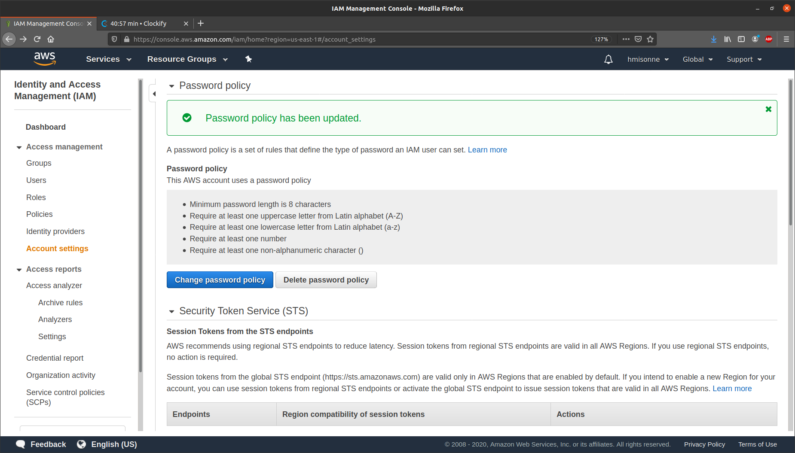
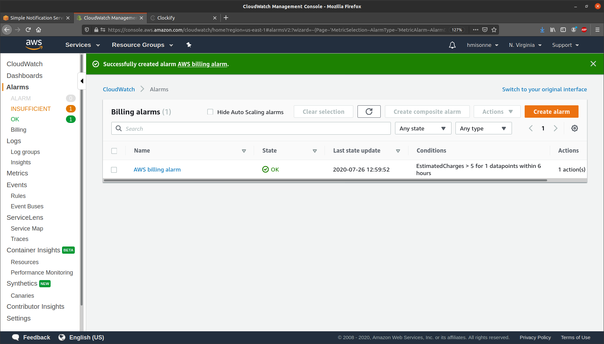
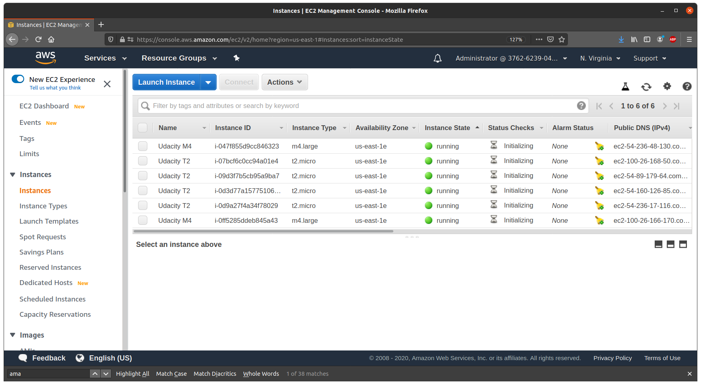
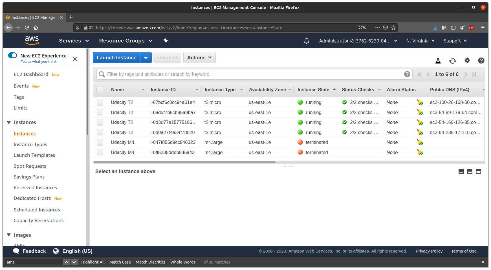
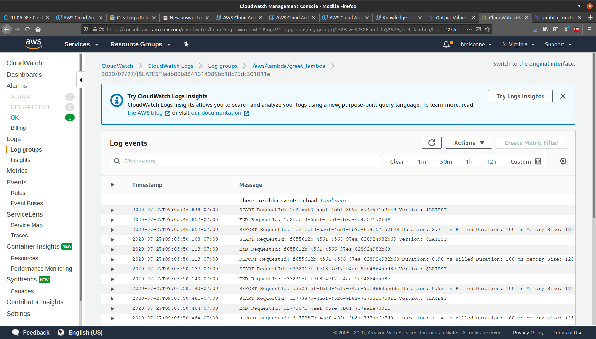

# AWS_Performance_Scalability
Set of projects to plan, design, provision, and monitor infrastructure in AWS using industry-standard and open source tools

## Task 1: Create AWS Architecture Schematics
### Part 1
Plan and provision a cost-effective AWS infrastructure for a new social media application development project for 50,000 single-region users. 

### Part 2
Plan a SERVERLESS architecture schematic for a new application development project. 

## Task 2: Calculate Infrastructure Costs

## Task 3: Configure Permissions.
Update the AWS password policy.

Create a Group named CloudTrailAdmins and give it the two CloudTrail privileges.
Configure a user named CloudTrail. Assign CloudTrail to the CloudTrailAdmins group

## Task 4: Set up Cost Monitoring

## Task 5 : Use Terraform to Provision AWS Infrastructure
### Part 1
Deploy 6 EC2 instances with Terraform using main.tf file

Use Terraform to delete the 2 m4.large instances.

### Part 2
Deploy an AWS Lambda Function using Terraform
CloudWatch log entry for the lambda function execution

