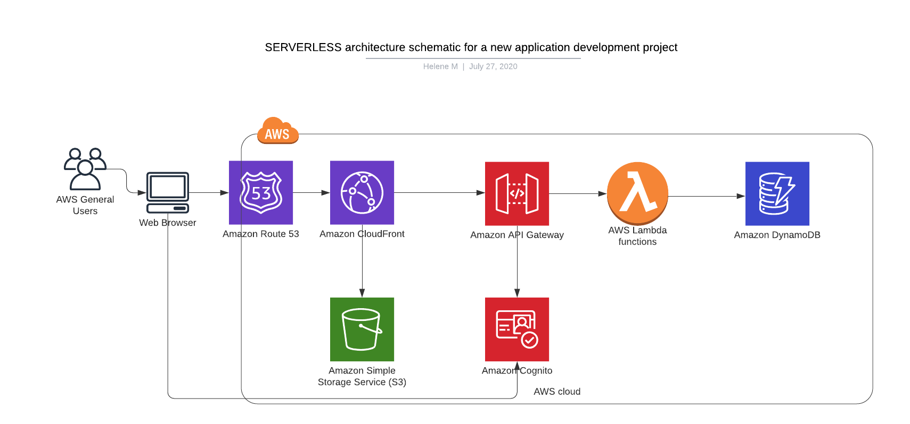

# AWS_Performance_Scalability
Set of projects to plan, design, provision, and monitor infrastructure in AWS using industry-standard and open source tools

## Task 1: Create AWS Architecture Schematics
### Part 1
Plan and provision a cost-effective AWS infrastructure for a new social media application development project for 50,000 single-region users. 

To ensure High-Availability, I added:
- A load balancer in front of an Auto-Scaling group of multi-AZ EC2 instances to ensure automatic failover and support single AZ outage.

To ensure High-Performance, I added:
- A cross region Read Replica to offload the read traffic
- A CloudFront distribution connected to a S3 bucket that host a static website to speed up the deliver of content through edge locations.

To ensure Security, I added:
- A RDS inside private subnets that only allows traffic from the load balancers.
- A NAT gateway that only allows egress traffic from the private subnet database to download updates and patches.

### Part 2
Plan a SERVERLESS architecture schematic for a new application development project. 

A Serverless architecture is suitable for applications with unpredictable traffic.
I placed an API Gateway in front of Lambda functions to have a pay per invocation model instead of provisioning resources. I also added Amazon Cognito to authentificate users.

## Task 2: Calculate Infrastructure Costs

## Task 3: Configure Permissions.
Update the AWS password policy.

Create a Group named CloudTrailAdmins and give it the two CloudTrail privileges.
Configure a user named CloudTrail. Assign CloudTrail to the CloudTrailAdmins group

## Task 4: Set up Cost Monitoring
I configured CloudWatch billing alarm with a $5 threshold and set up notification to get an email alert when the alarm is triggered

## Task 5 : Use Terraform to Provision AWS Infrastructure
### Part 1
I deployed 6 EC2 instances with Terraform using main.tf file

I used Terraform to delete the 2 m4.large instances by updating the resources on the main.tf file.

### Part 2
Deploy an AWS Lambda Function using Terraform
CloudWatch log entry for the lambda function execution

